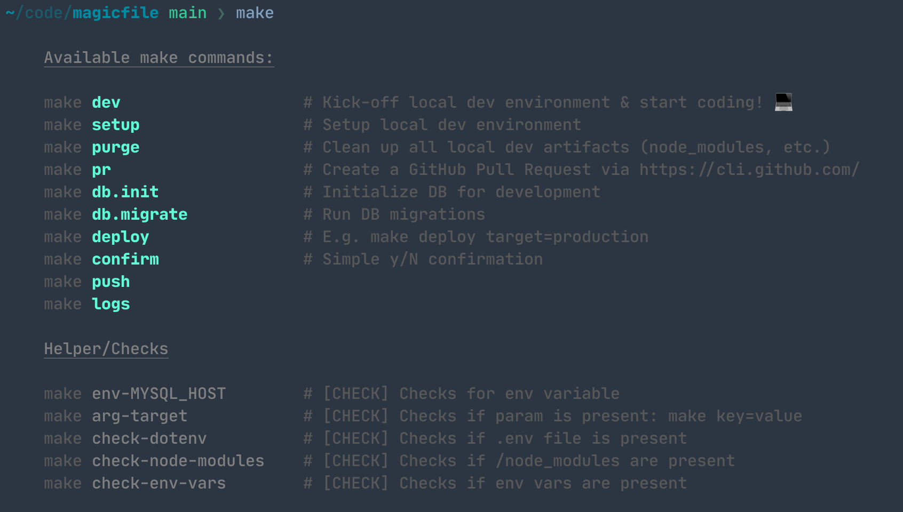

# Magicfile ✨



Simple `Makefile` template for situations when:

- You just need a simple way to document frequently used commands
- Don't want to create multiple `.sh` files just to document one-off CLI commands
- Want to easily share commands with your colleagues

## Installation

```
curl https://raw.githubusercontent.com/awinecki/magicfile/main/Makefile > Makefile
```

## Features

1. Type `make` to display nice help and list available commands
2. Display command descriptions nicely
3. Checks for validating env setup, env vars, params required for commands
4. Template for commands
5. Example how to use make commands with params (`make command param=value`)
6. Example how to use default params

# Usage & Tips

Add regular `make` commands. Some tips:

- Splitting commands on multiple lines is problematic in makefiles, but can be done with `/`

  ```shell
  check-param: # [CHECK] Checks if param is present: make key=value
  	@if [ "$(target)" = "" ]; then \
  		echo -e "${ERR}Missing param: target. Try: 'make cmd target=..'${NC}"; \
  		exit 1; \
  	fi
  
  vs.
  
  check-param: # [CHECK] Checks if param is present: make key=value
  	@if [ "$(target)" = "" ]; then echo -e "${ERR}Missing param: target. Try: 'make cmd target=..'${NC}"; exit 1; fi
  ```

- Add `@` in front of a command to prevent make from printing it

  ```
  echo "Hello World"
  
  vs.
  
  @echo "Hello World"
  ```

- Add checks as make required targets

  ```
  deploy: check-local-setup
    @deploy..
    
  check-local-setup:
  	@if test ...
  	@if test ...
  ```

# Demo

[](https://asciinema.org/a/eisdss6ueJFZ2jqwlWPGjMbGr)

## That's it!

Hope you find this useful! 🙌

If you have any questions or improvement ideas, please contact me 🙃.
